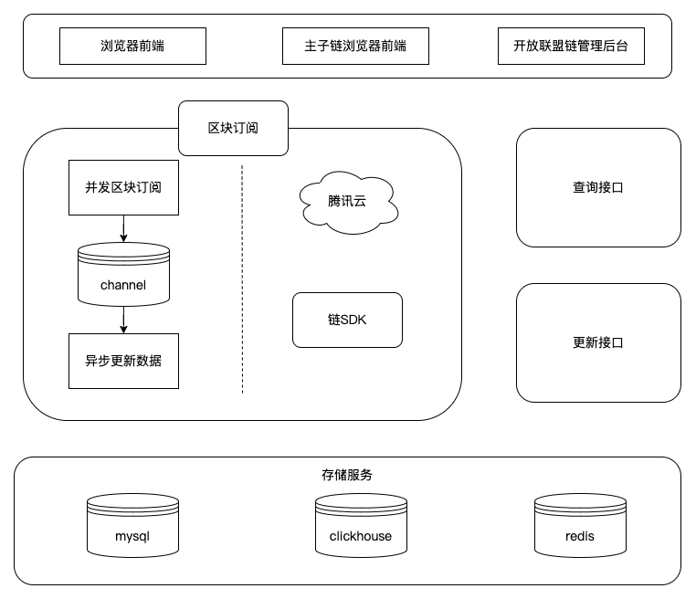
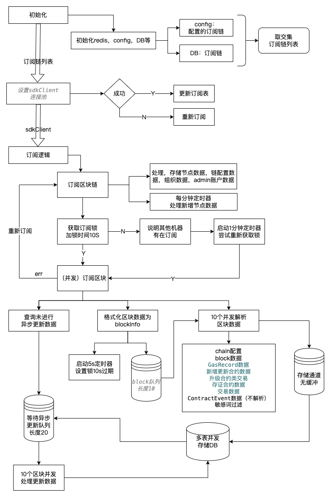
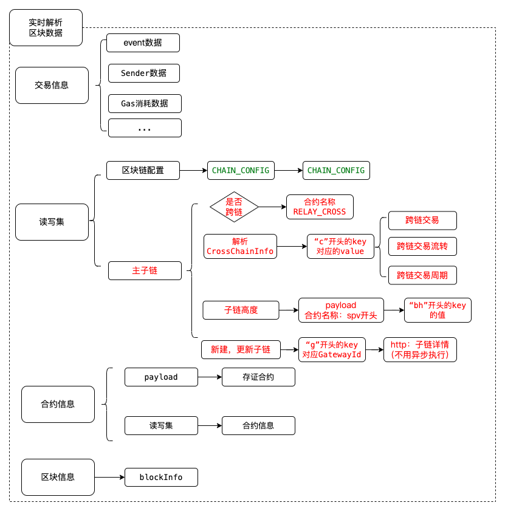
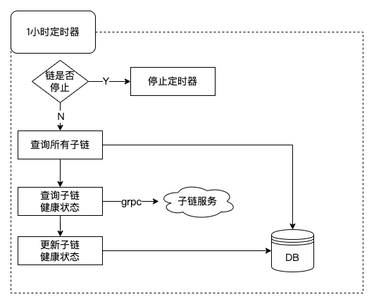

## 浏览器启动指南

#### 浏览器配置

以下是配置信息：

```plain
web:
  # Web监听网卡地址
  address:  0.0.0.0
  # Web监听端口
  port:     7999
  # 是否开启跨域:
  cross_domain:  true
  #对外暴露地址（公网）
  third_apply_url:  http://subchain-service:8888
  #主子链服务地址
  relay_cross_chain_url:  http://127.0.0.1
  # 开放测试网络地址（局域网）  ip地址不能以/结尾
  testnet_url:  http://172.21.0.12:8888
  # 开放联盟链后台地址
  opennet_url: http://opennet-manage-backend:17777/opennetManageBackend/formalnetPk
  # prometheus监控端口
  monitor_port: 13582
  #管理后台密钥
  manage_backend_api_key: AdSGavFKmbrzesqkZPQaVD2UGnqbbC

# 订阅链配置
chains:
  - chain_id: chain1
    auth_type: public
    org_id:
    hash_type: SM3
    user:
      priv_key_file: ./configs/crypto-config/node1/user/client1/client1.key
      cert_file:
    nodes:
      - tls: false
        tls_host: chainmaker.org
        ca_paths:
        remotes: 127.0.0.1:12301

db:
  # 数据库ip
  host: 192.168.3.170
  #数据库端口
  port: 3306
  #数据库用户名
  username: root
  #数据库密码
  password: 123456
  #数据库
  database: explorer_format_1
  # 表/索引 名称前缀
  prefix: format_10
  #数据库类型： ClickHouse / Mysql
  db_provider: Mysql

#redis缓存配置
db_redis:
  db: 0
  #redis地址
  host: 127.0.0.1:6379
  #redis用户名
  username: ""
  #redis密码
  password: ""
  # 缓存前缀，可以为空
  prefix: ""
  
# 是否订阅链
subscribe:
  enable: true
  
# 是否开启右上方订阅选项
chain:
  show_config: true
  #是否是主链
  is_main_chain: true
  #主链名称
  main_chain_name: 国家级区块链网络主网络
  #主链ID
  main_chain_id: chain1
 
# 敏感词过滤腾讯云服务
sensitive:
  #是否启用敏感词
  enable: false
  #腾讯云配置
  secret_id: 123456
  secret_key: 123456
  
# 告警
alarmer:
  # 开启企业微信告警
  wechat_enable: false
  # 开启钉钉告警
  ding_enable: false
  # 企业应用token
  wechat_access_token: 0f4b72d5-09dc-4e7e-afa3-5e8258d1a1da
  # 钉钉应用token
  ding_access_token: 123456
  # 告警信息前缀
  prefix: 123456

# 监控（告警信息请填写alarmer）
monitor:
  # 是否启用
  enable: false
  # 敏感词过滤预警返回最大交易数
  safe_word_limit: 10
  # 单用户短期大批量交易监控
  monitor_tx:
    # 间隔期内用户最大发交易数
    max_tx_num: 10000
    # 单次查询交易数
    tx_limit: 1000
  # 节点间允许最大区块高度差
  max_height_diff: 10
  # 最大尝试连接节点次数
  try_conn_num: 3
  # 触发间隔 (min) 至少10min
  interval: 1
  # 监控节点信息
  chains:
    - chain_id: chainmaker_testnet_pk
      auth_type: public
      org_id:
      hash_type: SM3
      user:
        priv_key_file: ./configs/crypto-config-pk/node1/user/client1/client1.key
        cert_file:
      nodes:
        - tls: false
          tls_host: chainmaker.org
          ca_paths:
          remotes: testnode.chainmakernet.com:17301
          
```
#### 浏览器启动

可通过`startup.sh`自拉起后台，脚本中需要配置对应的配置文件所在路径及启动文件，请按照实际情况进行设置，如下：

```shell
BROWSER_BIN="chainmaker-browser.bin"
cd ../src
go build -o ${BROWSER_BIN}
mv ${BROWSER_BIN} ../scripts
cd ../scripts
echo "Success build chainmaker-browser.bin"
CONFIG_PATH="/opt/chainmaker/explorer-backend/browser-backend/configs/"
nohup ./${BROWSER_BIN} -config ${CONFIG_PATH} >output 2>&1 &
```

如果启动的配置文件不是configs/config.yml，而是config.dev.yml，可以使用
```
nohup ./${BROWSER_BIN} -config ${CONFIG_PATH} --env dev >output 2>&1 &
```
可通过`shutdown.sh`将该服务停掉，对应的，如果启动文件有变化，也需要在脚本中进行调整，如下：

```shell
BROWSER_BIN="chainmaker-browser.bin"
```

## 浏览器设计方案

### 设计架构图


### 浏览器数据订阅流程图


### 主子链数据解析


### 子链健康状态检查
# ChineseChess-Chain
